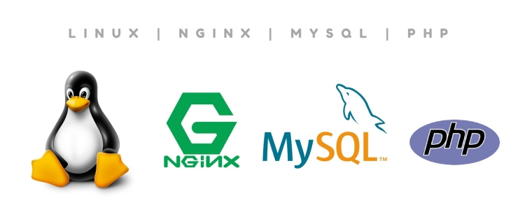
# Elevating Excellence: Deploying a High-Performance LEMP Stack Web Server on AWS Cloud

## Introduction:

Embark on this exciting journey with me as I show you how to establish a robust web infrastructure on AWS, as I guide you through the meticulous process of deploying a LEMP (Linux, Nginx, MySQL, PHP) stack on the dynamic landscape of AWS Cloud. In this comprehensive guide, We'll lay the foundation for high-performance web applications, unlocking the full potential of cloud-based innovation.

## STEP 1: Launching an EC2 Instance

Log in to your AWS Management Console.
Navigate to the EC2 dashboard and click "Launch Instance."

We choose an Amazon Machine Image (AMI) for this project We would be using Ubuntu 22.04, select an instance type We would be using the t2 micro, configure instance details, add storage, and configure security groups to allow SSH (port 22) this grants us secured access into our instance and HTTP (port 80) traffic.

Review the settings and launch the instance.

Once the instance is running, connect to it using SSH. Use the private key associated with your key pair.

## Step 2:  Update server package index and Install the Nginx Web Server


To showcase our web pages to our visitors, we'll leverage Nginx, a high-performance web server. Utilizing the apt package manager, we'll streamline the installation process. As a first step, update our server's package index, and then proceed with installing Nginx using apt install.


```
sudo apt update
sudo apt install nginx
```

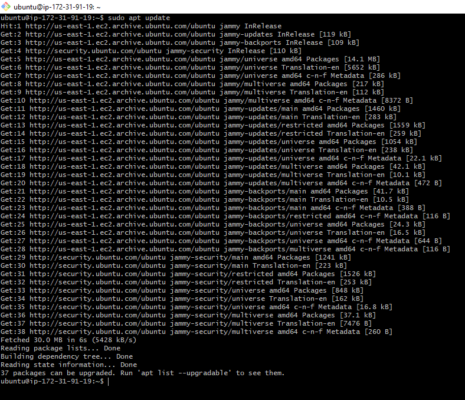

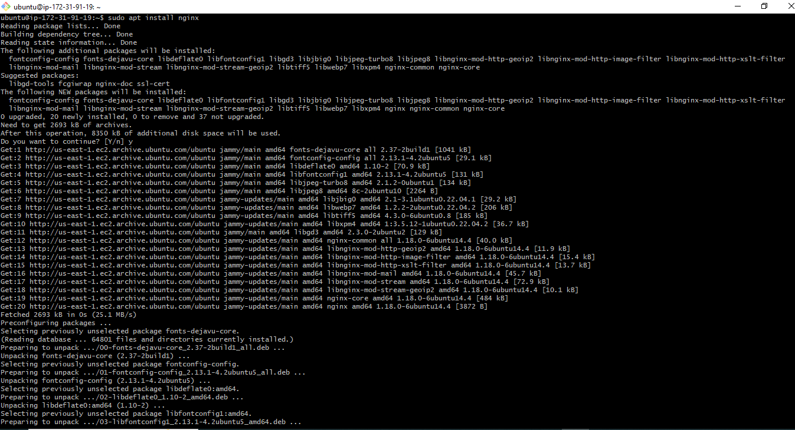

When prompted, enter 'Y' to confirm the Nginx installation. Once the installation is complete, the Nginx web server will be active on our Ubuntu 20.04 server. To confirm a successful installation and check the service status, run:

```
sudo systemctl status nginx
```
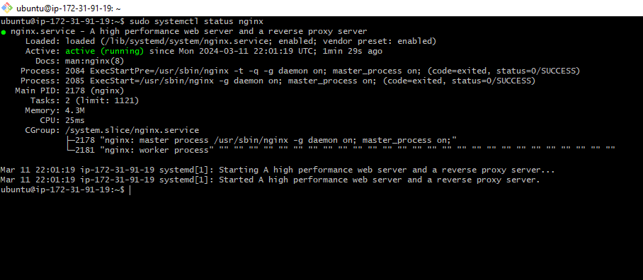

If the status is green and indicates that it's running, congratulations! We've successfully set up your first web server in the clouds. Well done!

To access the server locally from Git bash terminal use: curl `http://localhost:80`  
Or curl `http://127.0.0.1:80`

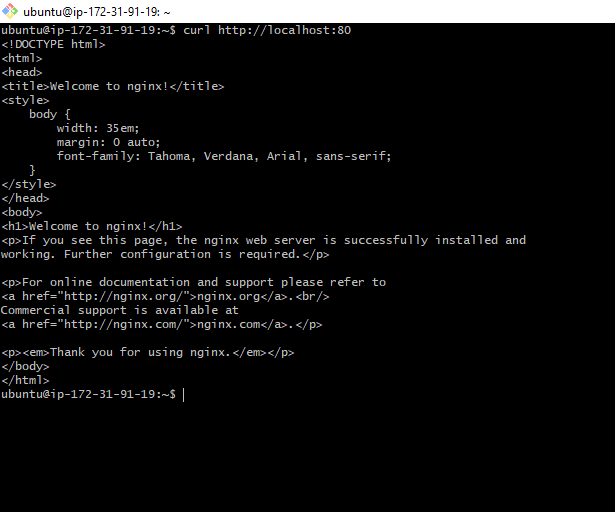

Now to assess how our Nginx server responds to internet requests, enter your public IP address `(http://Public-IP-Address:80)` into a web browser. The format should resemble the following:

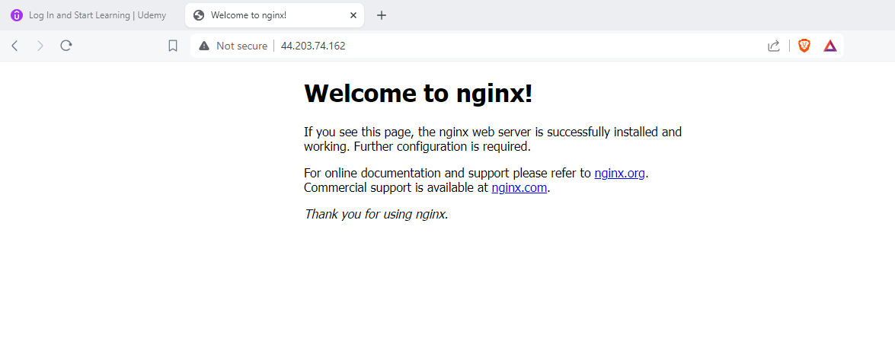

This shows that the web server is now correctly installed and accessible through our firewal

## Step 3: Installing MySQL

With our web server operational, the next step is to install a Database Management System (DBMS) to store and manage data for our site. MySQL, a widely used relational database management system in PHP environments, will be our choice for this project. Let's proceed with its installation.

```
$ sudo apt install mysql-server
```
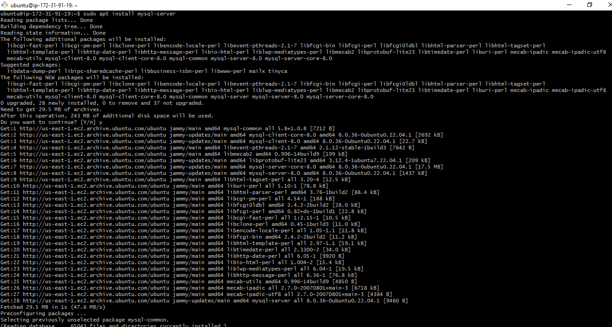

When prompted, confirm the MySQL installation by typing 'Y' and pressing ENTER.

Once the installation is complete, access the MySQL console by typing:

```
$ sudo mysql
```

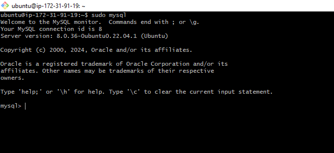

MySQL settings and enhance security. Run the security script by executing:

```
ALTER USER 'root'@'localhost' IDENTIFIED WITH mysql_native_password BY 'PassWord1@';
```
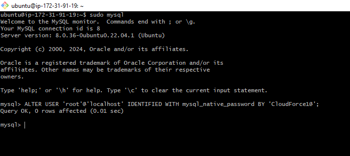

where we have password1@ input  your own reliable and strong password.

Exit the MySQL shell with:

```
mysql> exit
```

Start the interactive script by running:

```
$ sudo mysql_secure_installation
```
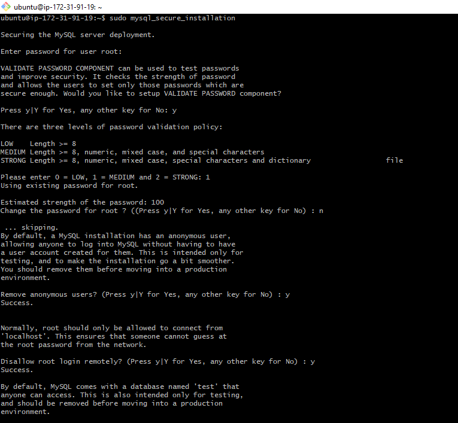

* Accept the configuration of the VALIDATE PASSWORD PLUGIN when prompted this is if you want the existing password to be changed. Choose one of the three levels for the password validation policy, and then enter a new password corresponding to the selected policy level.

* Subsequently, type 'Y' and press Enter at the following prompt. This action will remove any anonymous users and the test database, disable remote root logins, and implement the new rules to ensure that MySQL immediately incorporates the changes we've made.


When we are finished, we test if we are able to log in to the MySQL console by typing:

```
$ sudo mysql -p
```
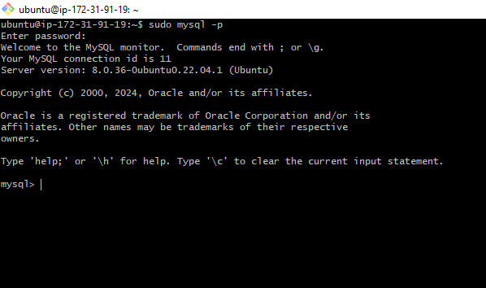

Notice the -p flag in this command, which will prompt us for the password used after changing the root user password.

To exit the MySQL console, type:

```
mysql> exit
```

Notice that we need to provide a password to connect as the root user.


## Step 4: Installing PHP

To process code and generate dynamic content, PHP needs to be installed alongside Nginx and MySQL. 

Unlike Apache, which embeds the PHP interpreter in each request, Nginx requires an external program to handle PHP processing. 

This program, called php-fpm (PHP FastCGI Process Manager), acts as a bridge between the PHP interpreter and the web server, enhancing overall performance for most PHP-based websites.

Additionally, installing php-mysql allows PHP to communicate with MySQL-based databases.

To install both packages simultaneously, execute the following command:

```
sudo apt install php-fpm php-mysql
```
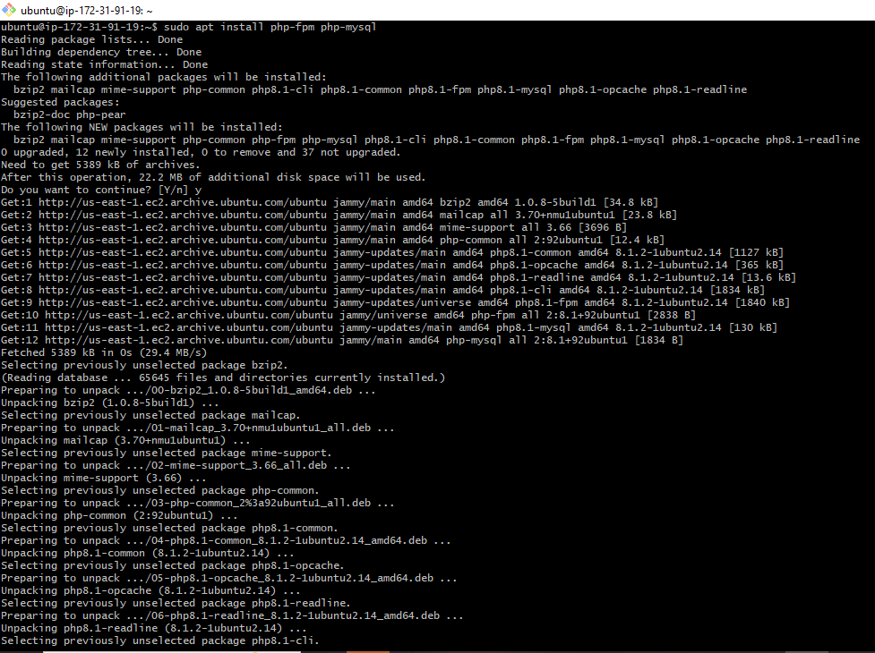

Confirm the installation by typing 'Y' and pressing ENTER when prompted.

With the PHP components now installed, the next step involves configuring Nginx to utilize them effectively. Let's proceed with the configuration.

## STEP 5: CONFIGURING NGINX TO USE PHP PROCESSOR

In Nginx, akin to Apache's virtual hosts, server blocks can host multiple domains on one server. For this guide, we'll use "projectLEMP" as an example domain.

By default, Ubuntu 20.04's Nginx serves from /var/www/html. Managing multiple sites is easier by creating domain-specific directories within /var/www. This leaves /var/www/html as the default directory for unmatched requests.

To create the root directory for "your_domain," follow these steps:


```
sudo mkdir /var/www/projectLEMP
```

Next, assign ownership of the directory with the $USER environment variable, which will reference our current system user:

```
sudo chown -R $USER:$USER /var/www/projectLEMP
```
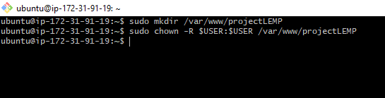


opening a new configuration file in Nginx’s sites-available directory called projectLEMP: 
```
sudo nano /etc/nginx/sites-available/projectLEMP
```
Add the following script in the file created:


```
#/etc/nginx/sites-available/projectLEMP

server {
    listen 80;
    server_name projectLEMP www.projectLEMP;
    root /var/www/projectLEMP;

    index index.html index.htm index.php;

    location / {
        try_files $uri $uri/ =404;
    }

    location ~ \.php$ {
        include snippets/fastcgi-php.conf;
        fastcgi_pass unix:/var/run/php/php8.1-fpm.sock;
     }

    location ~ /\.ht {
        deny all;
    }

}
```
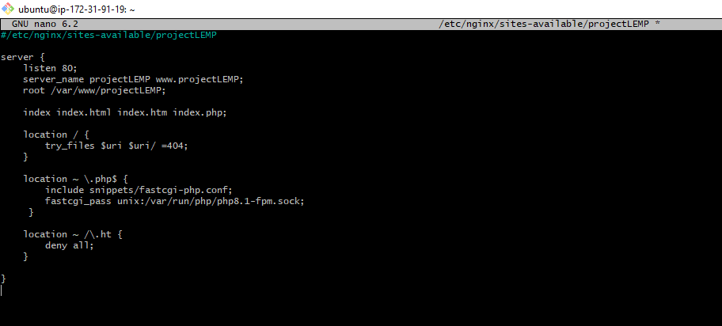


* Activate the configuration by linking to the config file from Nginx's sites-enabled directory:

```
sudo ln -s /etc/nginx/sites-available/projectLEMP /etc/nginx/sites-enabled/

```

* Test the configuration for syntax errors:

```
sudo nginx -t

```
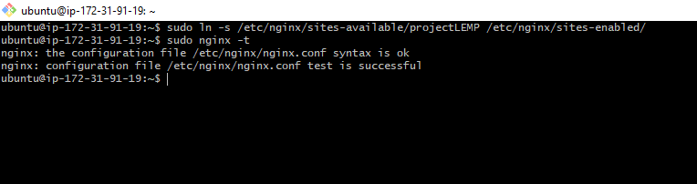

* Disable the default Nginx host configured on port 80:

```
sudo unlink /etc/nginx/sites-enabled/default

```
* Reload Nginx to apply the changes:

```
sudo systemctl reload nginx

```
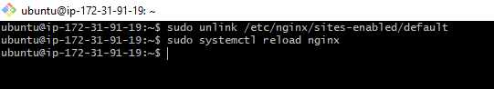

* Create an index.html file in the root web directory to test the new server block:
```
 $ sudo bash -c "echo -e 'Hello LEMP from hostname\n<h2>MATTHEW Cloud Force</h2>\n<h3>It is not the strongest of the species that survive, nor the most intelligent, but the one most responsive to change.</h3>' > /var/www/projectLEMP/index.html"
```
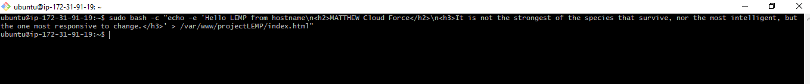

Now we go to our browser and try to open our website URL using IP address:

`http://<Public-IP-Address>:80`

We should see the below output

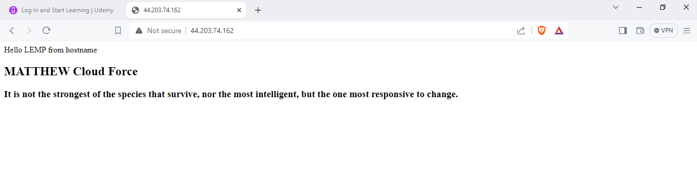

Our LEMP stack is now fully configured. In the next step, we'll create a PHP script to ensure that Nginx can handle .php files within our newly configured website.

## STEP 5: TESTING PHP WITH NGINX

In this phase, we will examine the functionality of PHP within the Nginx environment to ensure seamless integration.To validate that Nginx can correctly hand .php files off to my PHP processor is by creating a test PHP file in the root web document:

Create a file called info.php: 
```
nano /var/www/projectLEMP/info.php
```
Add the following script:

```
<?php
phpinfo();
```

To access this page in the web browser, use the following URL: `http://Public_IP_address/info.php`

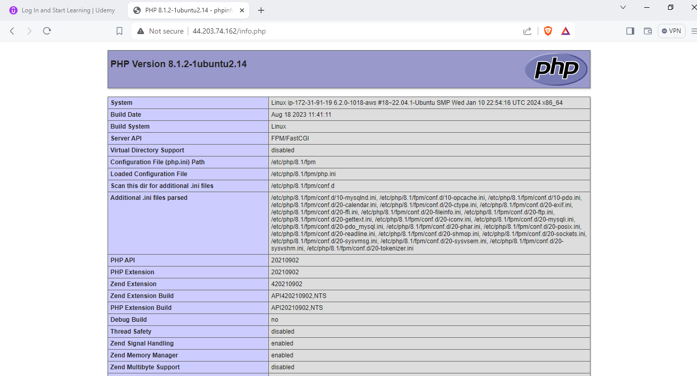

After reviewing the pertinent information about our PHP server on that page, it's advisable to remove the file you created, as it contains sensitive details about our PHP environment and our Ubuntu server. We can use the rm command to delete that file:

```
sudo rm /var/www/projectLEMP/info.php

```
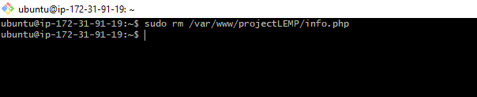

We can always regenerate this file if we need it later.

## Step 7: Retrieving data from MySQL database with PHP

In this step, we'll create a test database (DB) with a simple "To-Do list" and configure access to it. This setup allows the Nginx website to query data from the DB and display it.

* First is connecting to MySQL console:` $ sudo mysql -p`

* Creating a new user and granting full privileges on the database using `mysql_native_password` as the default authentication method:

```
CREATE USER 'example_user'@'%' IDENTIFIED WITH mysql_native_password BY 'password';
GRANT ALL ON example_database.* TO 'example_user'@'%';

```

Replace 'example_user' with our desired username and 'password' with a strong and secure password. This ensures that the new user has the necessary permissions on the specified database. Here we would be using example-user as our username and PassWord1@ as our password. ensure the password meets the security password validation policy standard we selected earlier if not it would throw an error.
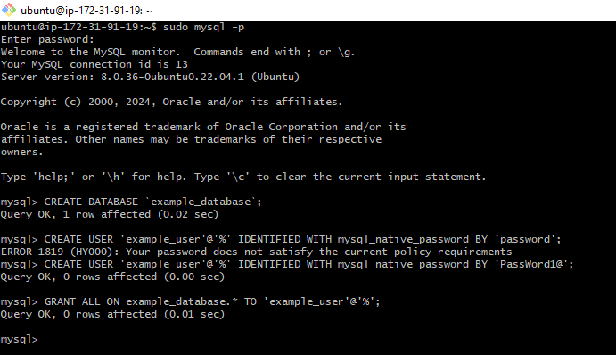

* Exiting from MySQL console:` mysql> exit`

We can test if the new user has the proper permissions by logging into the MySQL console again, this time using the custom user credentials:
```
mysql -u example_user -p

```

Confirm that we have access to the example_database database:

```
mysql> SHOW DATABASES;
```

This will give you the following output:


```
Output
+--------------------+
| Database           |
+--------------------+
| example_database   |
| information_schema |
+--------------------+
2 rows in set (0.000 sec)
```

Next, we’ll create a test table named todo_list. From the MySQL console, run the following statement:

```
CREATE TABLE example_database.todo_list (
    item_id INT AUTO_INCREMENT,
    content VARCHAR(255),
    PRIMARY KEY(item_id)
);

```
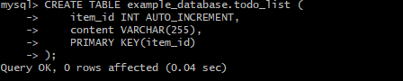

Insert a few rows of content in the test table. We might want to repeat the next command a few times, using different VALUES:

```
mysql> INSERT INTO example_database.todo_list (content) VALUES ("My first important item");
```

To confirm that the data was successfully saved to our table, run:

```
mysql>  SELECT * FROM example_database.todo_list;mysql>  SELECT * FROM example_database.todo_list;
```

We should see the following output:

```
Output
+---------+--------------------------+
| item_id | content                  |
+---------+--------------------------+
|       1 | My first important item  |
|       2 | My second important item |
|       3 | My third important item  |
|       4 | Other Items on the List  |
+---------+--------------------------+
4 rows in set (0.000 sec)
```
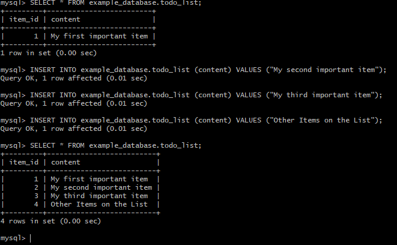

After we confirm that we have valid data in our test table, we can exit the MySQL console:

```
mysql> exit
```

Creating a new PHP file named `todo_list.php` in our custom web root directory and generating a PHP script to connect to MySQL and query for our content can be achieved with the following command:

```
nano /var/www/projectLEMP/todo_list.php

```

This command opens the Nano text editor for you to create and edit the `todo_list.php` file.

Add the following PHP script:

```
<?php
$user = "example_user";
$password = "PassWord1@";
$database = "example_database";
$table = "todo_list";

try {
  $db = new PDO("mysql:host=localhost;dbname=$database", $user, $password);
  echo "<h2>TODO</h2><ol>";
  foreach($db->query("SELECT content FROM $table") as $row) {
    echo "<li>" . $row['content'] . "</li>";
  }
  echo "</ol>";
} catch (PDOException $e) {
    print "Error!: " . $e->getMessage() . "<br/>";
    die();
}
```
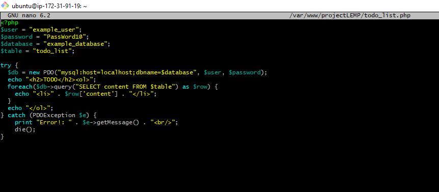

Save and close the file when we are done editing.

We can now access this page in our web browser by visiting the domain name or public IP address configured for our website, followed by `/todo_list.php`:


```
http://<Public_domain_or_IP>/todo_list.php
```
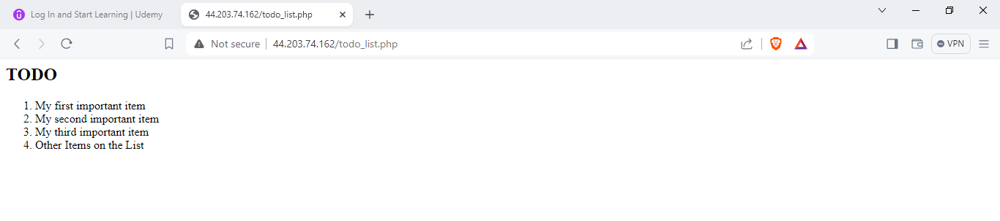

Congratulations!

In this guide, we've successfully established a versatile foundation for serving PHP websites and applications to our visitors. 

Utilizing Nginx as the web server and MySQL as the database management system, we've created a robust environment ready to connect and interact seamlessly. Well done!